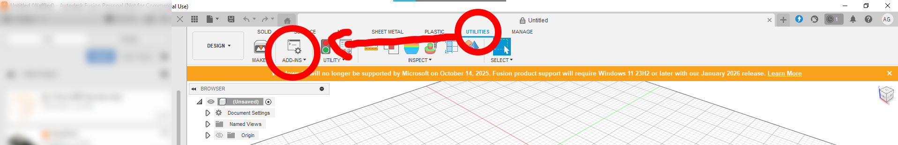
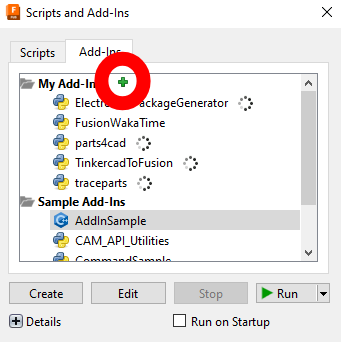

# Installation Guide
### Credits
credits to @its-kronos for hotfixing while i was asleep 


## Prerequisites

- Fusion 360
- Python
- Windows 10/11

## Download

1. Clone the repository:
   ```bash
   git clone https://github.com/LiveWaffle/Hackatime-Fusion360.git

2. Rename the cloned folder to "FusionWakaTime"

3. Open Fusion 360 > Utilities > Addins > Create New

4. *Optional* Check Run on startup


   
   

